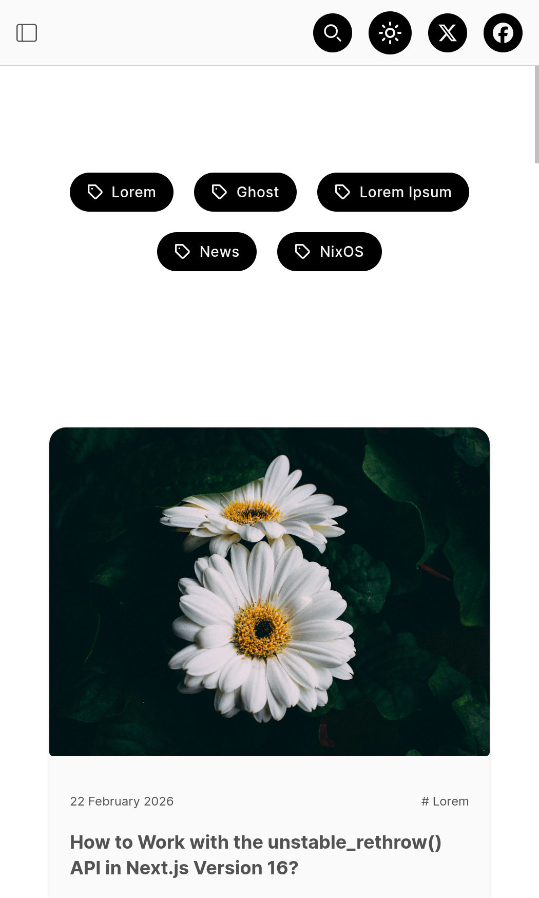

# Logly Theme

A stylish, modern, and content-focused theme for Ghost. Logly is designed to be easy to use and customize, providing a great reading experience for your audience.

<details> <summary>  Demo </summary>
    
<video src="https://github.com/user-attachments/assets/e6debd74-dd5d-4d50-8ec9-cf2935dd179a" width="724"></video>

> Image 1


> Image 2


> Image 3


> Image 4


> Image 5


</details>

## Installation Guide

Installing the Logly theme on your Ghost blog is a straightforward process. Follow these simple steps:

1. **Download the Theme**
   - Navigate to the [releases page](https://github.com/frontendweb3/logly/releases) of this repository.
   - Download the latest `logly.zip` file from the latest release.

2. **Upload to Ghost**
   - Log in to your Ghost admin panel.
   - Go to **Settings** -> **Design**.
   - Click on **Change theme** and then click the **Upload theme** button.
   - Select the `logly.zip` file you downloaded.

3. **Activate the Theme**
   - Once the upload is complete, click **Activate** to start using the Logly theme on your site.

That's it! Your Ghost blog is now using the Logly theme.

&nbsp;

## Development

If you're a developer and want to customize the theme, you can set up a local development environment.

### 1. Setup

Clone the repository and install the dependencies. We recommend using `pnpm` for package management.

```bash
# Clone the repository
git clone https://github.com/your-username/logly.git

# Navigate to the theme directory
cd logly

# Install dependencies
pnpm install
```

### 2. Run Development Server

Start the development server to see live changes as you edit the files.

```bash
pnpm run dev
```

This will compile the assets and enable live reloading. Any changes to CSS, JavaScript, or Handlebars (`.hbs`) files will be reflected in your browser automatically.

### 3. Build for Production

When you're ready to deploy your changes, build the theme assets for production and  create a zip file.

```bash
pnpm run build
```

This will create a `logly.zip` file in the root of the project, which you can then upload to your Ghost blog.

## 🟦 Background Variables

1. `--color-surface`: The main background color for the page (usually white in light mode).

2. `--color-surface-alt`: An alternate background color used for sections, cards, or sidebars to create subtle contrast.

3. `--color-surface-dark`: The main background color for Dark Mode (usually a very dark neutral or slate).

## 📝 Text Variables

1. `--color-on-surface`: The standard body text color (usually a medium-dark gray).

2. `--color-on-surface-strong`: Used for headings, bold text, or anything that needs high emphasis (usually near-black).

3. `--color-on-surface-dark`: The standard text color for Dark Mode.

4. `--color-on-surface-dark-strong`: High-emphasis text for Dark Mode (usually pure white).

## Copyright & License

Copyright (c) 2023-2026 Logly - Released under the [MIT license](LICENSE).
